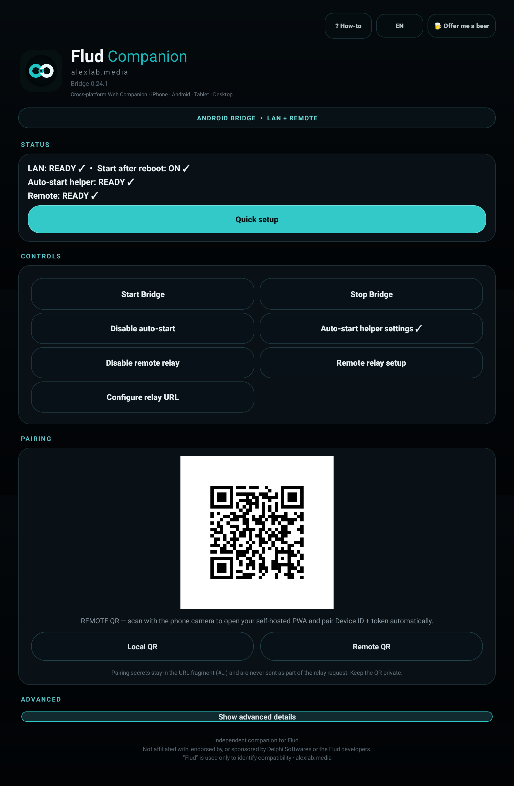
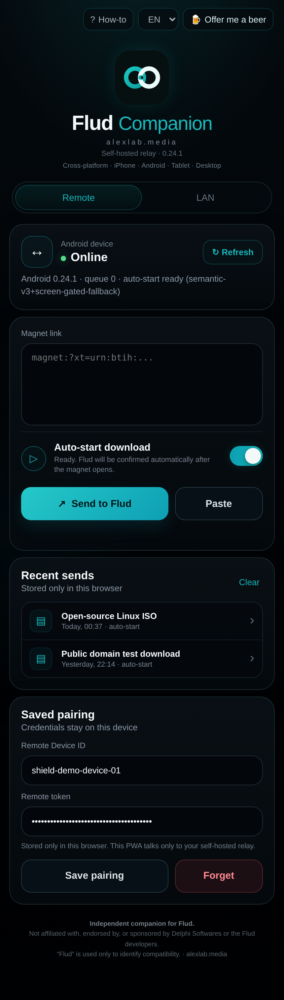

# Flud Companion

**Remote control for Flud from iPhone, Android, tablet or desktop - including Flud running on Android TV / NVIDIA Shield.**

**[Download the signed Android APK](https://github.com/Zuzuitu/flud-companion/releases/download/v0.24.1/FludCompanion-0.24.1.apk)** · [0.24.1 release notes](https://github.com/Zuzuitu/flud-companion/releases/tag/v0.24.1) · [Quick start](docs/quick-start.md) · [Changelog](CHANGELOG.md)

Flud Companion adds a browser-based remote interface to **Flud / Flud+**. Install the small Android Bridge on the device that runs Flud, then control it from **iPhone, Android, tablet or desktop** over your home LAN or remotely over the internet.

Typical use cases:

- control **Flud on NVIDIA Shield / Android TV** from your phone;
- send **magnet links to Flud from iPhone** or any modern browser;
- use a lightweight **Flud web interface / remote control** on your local network;
- control Flud away from home without exposing an inbound router port;
- self-host Remote through your own **Cloudflare Worker + R2** account.

No Tailscale or project-owned cloud account is required for Remote mode. Each user owns their own relay.

> **Independent project:** Flud Companion is an unofficial alexlab.media companion project. It is not affiliated with, endorsed by, or sponsored by Delphi Softwares or the developers of Flud. The name “Flud” is used only to identify compatibility.

## Preview

<table>
  <tr>
    <td align="center"><strong>Android Bridge - NVIDIA Shield / Android TV</strong></td>
    <td align="center"><strong>Remote PWA</strong></td>
  </tr>
  <tr>
    <td valign="top"></td>
    <td valign="top"></td>
  </tr>
</table>

## Current release - 0.24.1

0.24.1 is the first stable release of Flud Companion. The Android Bridge and Remote PWA have been validated on real NVIDIA Shield / Android TV hardware and iPhone across LAN and Remote use.

### What's new

- Saved pairing in the Remote PWA can now be hidden and shown again without removing the pairing.
- Small bug fixes and stability improvements.
- Signed stable Android APK using the same permanent project signing identity as the beta releases.

See the [0.24.1 notes](docs/releases/v0.24.1.md), [release history](docs/releases/README.md) and full [CHANGELOG](CHANGELOG.md).

### Quick setup

The Android Bridge supports:

- **LAN only** - direct local control, no cloud required;
- **LAN + Remote** - local control plus a user-owned self-hosted relay.

For Remote, the intended setup is:

`Deploy to Cloudflare → Copy relay URL → enter it once in Bridge → scan Remote QR → done`

## What you get

- Android / Android TV Bridge for Flud and Flud+ compatibility
- Local controller at `http://<android-device-ip>:8765/app`
- One-scan Local QR pairing
- One-scan Remote QR pairing
- Bring-your-own Cloudflare Worker + R2 relay
- No inbound home-network port required
- Remote PWA served by each user's own relay
- Optional guarded Auto-start through Android Accessibility
- English / Romanian / French / German UI
- Recent-send history stored only in the browser
- Optional browser-local support reminder; no project telemetry

The interface uses the same linked-rings identity across Android Bridge, Local LAN UI, Remote PWA, app icon and Android TV presentation. Android is organized around **Status → Controls → Pairing → Advanced**, while the phone UI provides a compact device status card, magnet composer, Auto-start switch, primary send action, recent-send list and saved pairing.

## Public architecture

At home:

`Phone browser → LAN Bridge → Flud`

Remote:

`Phone PWA → user's Cloudflare relay → outbound HTTPS polling → Android Bridge → Flud`

## Remote relay

The relay root provides:

- Worker online status;
- exact relay URL;
- **Copy relay URL**;
- shortcut to the Remote PWA;
- short pairing steps.

The self-host template declares its R2 mailbox with a default resource name so Cloudflare can provision it during deployment.

## Documentation

Start with:

- [Quick start](docs/quick-start.md)
- [Remote relay setup](docs/relay-setup.md)
- [Zero-to-working new-user guide](docs/new-user-zero.md)
- [Troubleshooting](docs/troubleshooting.md)
- [Browser support](docs/browser-support.md)
- [Release history](docs/releases/README.md)
- [Changelog](CHANGELOG.md)
- [FAQ](docs/faq.md)
- [Privacy](docs/privacy.md)
- [Security policy](SECURITY.md)
- [Contributing](CONTRIBUTING.md)
- [Credits](docs/credits.md)

## Security

Keep LAN tokens, Remote tokens and pairing QR codes private. The relay stores only a SHA-256 hash of the Remote token.

Use torrent/magnet content only where you have the right to download it.

## Support reminder

After every 50 successful magnet sends in a given browser/origin, the Web Companion can show a small optional support reminder. The counter stays in local browser storage; it is not telemetry and is not sent to alexlab.media. LAN and Remote origins keep independent counters by browser security design.

## License

Flud Companion is licensed under the **Apache License, Version 2.0** (`Apache-2.0`). See `LICENSE` for the full terms.
